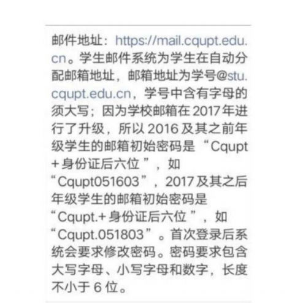
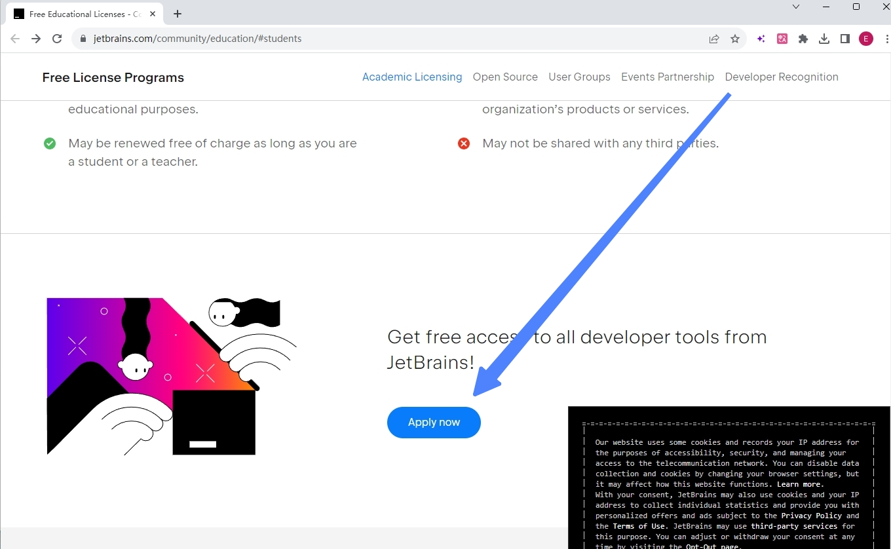
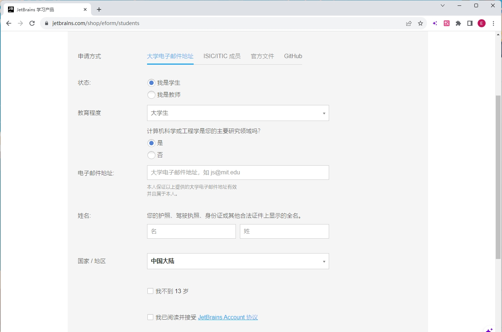
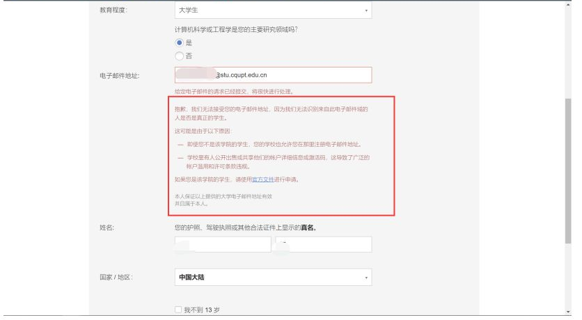
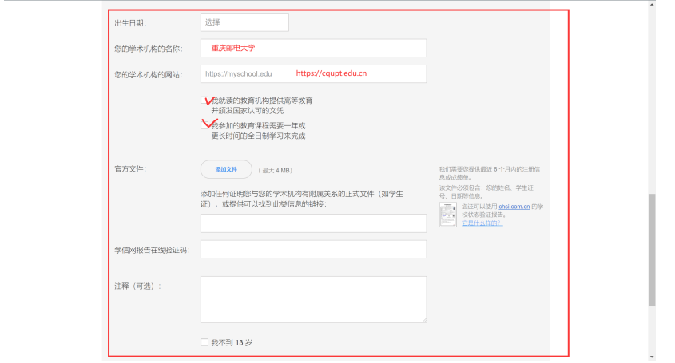
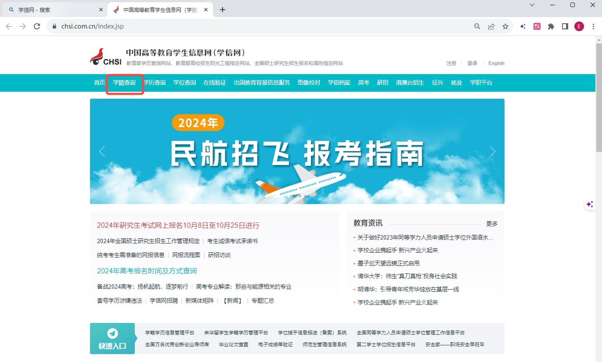
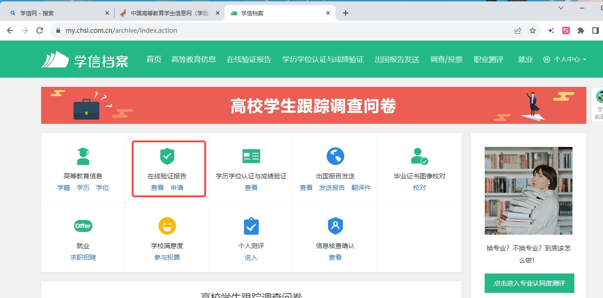
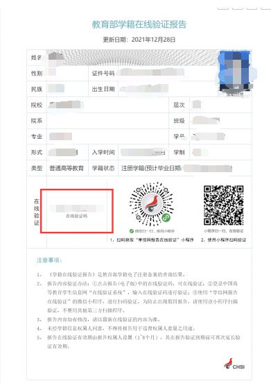
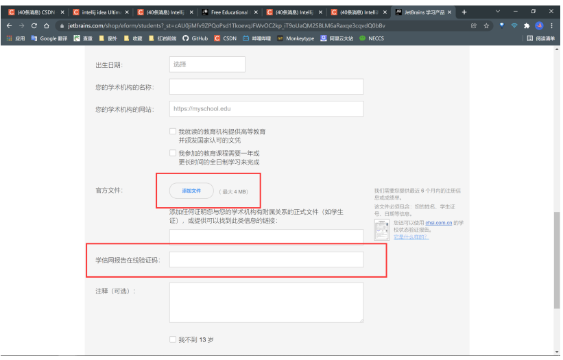
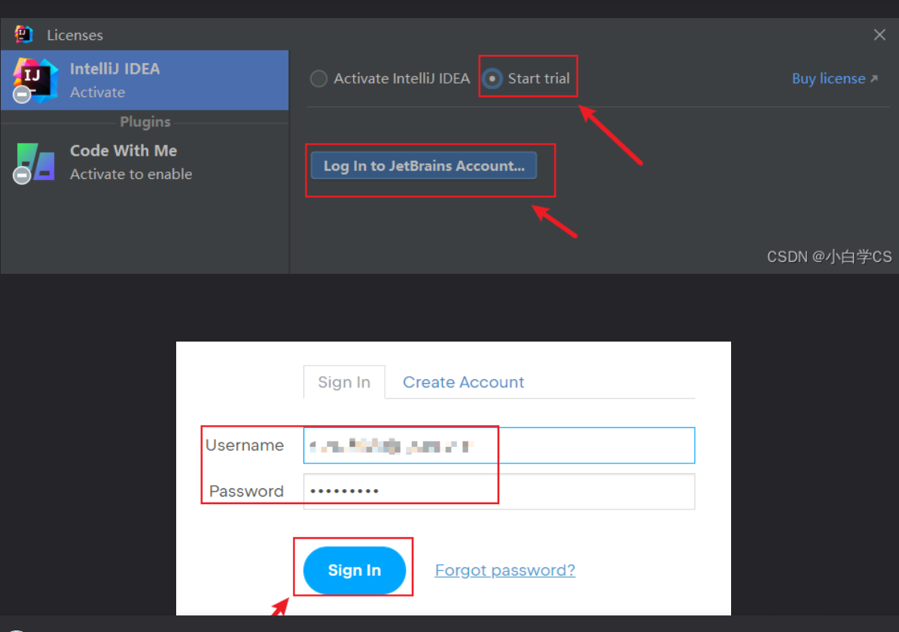

# **OKay** **兄弟们；准备起飞** **--->** **新世界的大门：**

### 首先，咱们java语言需要准备专用的编译器：

这个神奇的javaer编译器就是：IntelliJ IDEA 专业版（只有IDEA的专业版才有后台开发的能力，社区版，也就是咱们之前用的版本没有这个功能）

# 一，专业版申请

## 这个 IntelliJ IDEA 专业版 得到官方申请的，流程如下：

**1、首先，得先我们的重庆邮电大学学生教育邮箱：**

#### 

> 登录网址：[点击这里](https://mail.cqupt.edu.cn/)
>
> 账号：学号 + @stu.cqupt.edu.cn
>
> 密码：Cqupt. + 身份证后六位（注意有个点.）

**2、进入JetBrains Toolbox 申请 IntelliJ IDEA 专业版的官网：**[点击这里](https://www.jetbrains.com/community/education/#students)



**点击Apply now**



**填写信息然后就会出现这样的爆红这需要我们的官方文档**

点击**官方文档**



**接下来，需要我们的官方文档，也就是这个：**



**点击那个网址**:[或点这里也可以](https://www.chsi.com.cn/)

**3、登录学信网，完善基本信息就可以了**




完了过后 查看申请**在线验证报告**



**将这个截图保存下来**

**并复制那个 在线验证码**



**添加图片,填写验证码提交就可以咯！！！**





**等一到两周会给教育邮箱发消息，到时候注意查看咧！！**

# 二、jdk下载与环境配置

### 我们申请完学生认证后，先来安装我们需要的开发环境jdk8（后续会用到jdk17等，初学还是从8开始较好）

### [直接参考网上大佬教学]([（超详细）2022年最新版java 8（ jdk1.8u321）安装教程_java8下载-CSDN博客](https://blog.csdn.net/JunLeon/article/details/122623465?ops_request_misc=%7B%22request%5Fid%22%3A%22169804197816800182739517%22%2C%22scm%22%3A%2220140713.130102334..%22%7D&request_id=169804197816800182739517&biz_id=0&utm_medium=distribute.pc_search_result.none-task-blog-2~all~top_positive~default-1-122623465-null-null.142^v96^pc_search_result_base7&utm_term=jdk8&spm=1018.2226.3001.4187))


# 三、idea的安装

### [点这里](https://blog.csdn.net/weixin_44778232/article/details/128506296?ops_request_misc=&request_id=&biz_id=102&utm_term=idea%E5%AE%89%E8%A3%85&utm_medium=distribute.pc_search_result.none-task-blog-2~all~sobaiduweb~default-6-128506296.142^v96^pc_search_result_base7&spm=1018.2226.3001.4187)

## 注意！！！

##### 这里的账户密码用刚刚学生认证过的账号



**这里的jdk选择刚刚安装的jdk8（jdk1.8就是jdk8）环境，如果没有就是没有安装成功，去cmd里输入**

```terminal
java -version
```

**试试或者检查一下path下有没有jdk8的路径**

# 四、我们想说的

### 1.首先刚刚一系列操作做完，文章的最后hello world可以跟着写了试试，刚配置好的环境不去练练手 O.o？

### 2.其次如有不会的问题，随时欢迎群里@或者私信我们，学长们很乐意帮忙解答你们的问题。

## （但是！！！！！！！！！：

### 学长们肯能平时比较忙碌，不能骚扰！如有问题可以自己上网搜索，问gpt，或者跟同学讨论，尝试自己解决问题，培养自己上网解决问题的能力！（重要））

