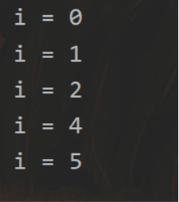

# 蓝山工作室2023Java第一节课: 语言基础

## Java的发展历史

上个世纪90年代，消费类电子产品越来越受人追捧，为了提升消费类电子产品的智能化程度。Sun公司为了抢占市场先机，在1991年成立了一个称为Green的项目小组，专攻计算机在家电产品上的嵌入式应用。由于可以用的资源极其有限。很多成员发现C++太复杂以至很多开发者经常错误使用。而且C++缺少垃圾回收系统，还有可移植的安全性、分布程序设计、和多线程功能。为了解决这个麻烦的问题，他们决定开发出一种新的语言 **他就是java的前身：**

— — **Oka（橡树）**

对，java的前身就是Oka。之所以起Oka这个名字，是因为团队对这门语言的首先期望就是健壮，而当时团队的办公室外刚好有一颗橡树，高大，健壮。受此启发，Oka就被用作Java语言的第一个名字，寓意着这是一门**简单、健壮的语言。**

而后来因为版权的问题，Oka不得不改名，但关于改成什么，大家并没有灵感，**直到有一天团队的几个主要成员在一起喝咖啡，正品尝一种来自爪哇岛（Java）的咖啡**。此时，其中的一个工程师突然想到，他们之所以要创建一门新语言，在很大程度上，就是期望把程序员从工程的泥潭中拯救出来，从而让大家有闲暇的时间来品一杯美味的咖啡。于是**Oka就被改名为Java**，**寓意着程序员如果用Java开发，从此之后能过上从容、惬意的生活(不是)。**


## Java主要特性

- **Java 语言是简单的：**

  Java 语言的语法与 C 语言和 C++ 语言很接近，使得大多数程序员很容易学习和使用。另一方面，Java 丢弃了 C++ 中很少使用的、很难理解的、令人迷惑的那些特性，如操作符重载、多继承、自动的强制类型转换。特别地，Java 语言不使用指针，而是引用。并提供了自动分配和回收内存空间，使得程序员不必为内存管理而担忧。

- **Java 语言是面向对象的：**

  Java 语言提供类、接口和继承等面向对象的特性，为了简单起见，只支持类之间的单继承，但支持接口之间的多继承，并支持类与接口之间的实现机制（关键字为 implements）。Java 语言全面支持动态绑定，而 C++语言只对虚函数使用动态绑定。总之，Java语言是一个纯的面向对象程序设计语言。

- **Java 是高性能的：**

  与那些解释型的高级脚本语言相比，Java 的确是高性能的。事实上，Java 的运行速度随着 JIT(Just-In-Time）编译器技术的发展越来越接近于 C++。

- **Java具有完整并不断发展的生态**

  Java发展时间长,受到全世界众多程序员的青睐,建立了完整的生态。你在编写Java程序时遇见的bug永远有人比你先遇见,所以你可以相关网站上寻找解答。Java还有强大的spring框架,在不久的学习后你们也会接触到

### 学习Java的一些建议


- 最重要的就是多敲代码，多敲代码，多敲代码。不要图快，跟着视频学习一定要自己敲一遍代码，基础是非常重要的，万丈高楼平地起，多敲代码才能巩固基础。
- 养成记笔记的习惯,可以学习markdown语法,用来记笔记很方便
- 学会从各种平台上获取资源 (按住ctrl点击)
    - ([CSDN - 能解决大部分问题](https://www.csdn.net/))
    - [博客园 - 很多老程序员在上面分享经验 (cnblogs.com)](https://www.cnblogs.com/)
    - [哔哩哔哩 (゜-゜)つロ 干杯~-有许多优质的学习视频](https://www.bilibili.com/)
    - [GitHub](https://github.com/)
    - [Gitee - 中文的GitHub](https://gitee.com/)
    - [Java 教程 | 菜鸟教程 (runoob.com)](https://www.runoob.com/java/java-tutorial.html)
- 学习初期报错是非常正常的,一定不要气馁.
- 学习初期不建议阅读书籍（如果你习惯于在书本上学习也行），因为书上的内容多而杂，很容易劝退刚接触编程的人。推荐跟着视频学习，发现bug也容易在评论或者弹幕中找到问题。

## 了解(JDK,SDK,Jar,JVM,JRE)

```shell
## SDK:

**SDK是Software Development Kit 一般指软件开发包，可以包括函数库、编译程序等**。
    
## JRE:

##JRE顾名思义是java运行时环境，包含了java虚拟机(jvm)，java基础类库。是使用java语言编写的程序运行所需要的软件环境，是提供给想运行java程序的用户使用的。
    
## JVM:JVM是Java Virtual Machine的缩写

**JVM是编译java代码的虚构计算机，jvm使得Java语言在不同平台上运行时不需要重新编译。Java语言使用Jvm虚拟机屏蔽了与具体平台相关的信息，使得Java语言生成在Java虚拟机上运行的目标代码，就可以在多种平台上不加修改地运行。**
    
## JDK：

**是java开发工具包，是程序员使用java语言编写java程序所需的开发工具包，是提供给程序员使用的。JDK包含了JRE.简单的说JDK是面向开发人员使用的SDK，它提供了Java的开发环境和运行环境。****

   
## Jar:
                                                                                                      
**开发人员写好的.java文件打包编译就会生成jar包，里面包含了我们写好的源码**
```

## 第一个Java程序


[IDEA相关配置](https://gitee.com/zhengqingya/idea-config)

现在我们来编写第一个Java程序,以IDEA为例

第一个程序,当然是hello,world了!

```Java
public class HelloWorld {
    public static void main(String[] args) {
        System.out.println("hello,world!");
        System.out.println("hello,蓝山");
    }
}
```

编写完以上代码后,按下IDEA快捷键`ctrl + shift + f10` 或者右键点击运行就能输出hello,world了


```Java
public class HelloWorld
{
    public static void main(String[] args)
    {
        System.out.println("(♥◠‿◠)ﾉﾞ  hello world!   ლ(´ڡ`ლ)ﾞ  \n" +
                " .-------.       ____     __        \n" +
                " |  _ _   \\      \\   \\   /  /    \n" +
                " | ( ' )  |       \\  _. /  '       \n" +
                " |(_ o _) /        _( )_ .'         \n" +
                " | (_,_).' __  ___(_ o _)'          \n" +
                " |  |\\ \\  |  ||   |(_,_)'         \n" +
                " |  | \\ `'   /|   `-'  /           \n" +
                " |  |  \\    /  \\      /           \n" +
                " ''-'   `'-'    `-..-'              ");
    }
}
```


### 对上述代码的解释

**main方法是一切程序的入口**

main方法是一个程序的入口,一个类中只能有一个main方法.

**void ,返回类型**

void 表示这个方法没有返回值.


## Java基础语法

一个 Java 程序可以认为是一系列对象的集合，而这些对象通过调用彼此的方法来协同工作。下面简要介绍下类、对象、方法和实例变量的概念。

- 对象

你有对象吗? 不急,在Java中,你可以随时new 一个对象出来

对象是类的一个实例，有状态和行为。例如，一条狗是一个对象，它的状态有：颜色、名字、品种；行为有：摇尾巴、叫、吃等。

- **类**：类是一个模板，它描述一类对象的行为和状态。
- **方法**：方法就是行为，一个类可以有很多方法。逻辑运算、数据修改以及所有动作都是在方法中完成的。
- **实例变量**：每个对象都有独特的实例变量，对象的状态由这些实例变量的值决定。

编写Java程序时,应该注意以下几点

- **类名**: 类名的首字母必须大写,如果类名由多个单词组成,那么就使用驼峰命名法, 例如MyTest
- **大小写敏感**: Java是大小写敏感的,在编写时要注意.
- **方法名**：所有的方法名都应该以小写字母开头。如果方法名含有若干单词，则后面的每个单词首字母大写。
- **包名：** 所有的包名首字母要小写

### Java注释

类似于c语言，Java也有注释。给代码写注释是一个良好的编程习惯。可以使代码逻辑更加清晰，方便出错时找bug，也可以让别人更容易的看懂你的代码。

```java
public class HelloLanShan {
   /* 这是第一个Java程序
    * 它将输出 HelloLanShan
    * 这是一个多行注释的示例
    */
    public static void main(String[] args){
       // 这是单行注释的示例
       /* 这个也是单行注释的示例 */
       System.out.println("HelloLanShan"); 
    }
}
```

在IDEA中，可以使用快捷键`ctrl + /` 添加注释

注释掉的行和空白行，Java编译器都会忽略掉

### Java基本数据类型

Java中分为两大数据类型

- 基本数据类型
- 引用数据类型

#### 基本数据类型

```java
//Java内置了八种基本数据类型
//基本数据类型--四类八种：整数类（byte、short、int、long）、浮点类（float、double）、字符类（char）、布尔型（boolean）；
//除此之外即为引用类数据类型（上文中我们创建的对象）。
        int a = 1;//四个字节，范围
        short b = 1;//使用两个字节存储，范围为-32768~32767；
        long c = 1;//八个字节，-2^64，2^64-1
        double d = 1.7d;//使用8字节存储，精度是float的2倍，绝大部分应用程序采用float类型。
        float e = 1.6f;//使用4字节存储，精度可以精确到小数点后7位有效数字，在多数情况下，float类型精度很难满足需要。
//①默认浮点类型为double；②使用float的时候，数字后面要添加f;
        byte h = 127;使用1个字节存储，范围为-128~127；
        boolean f = true;//布尔型--boolean--只有true和false两个值，存储时占1位。
        char g = 'x';//字符类--char--占用2个字节，使用时用''单引号表示；'A';表示一个字符，"A"表示一个字符串，即一个字符序列
```

###### 整数

| 数据类型 | 说明                                                     |
| -------- | -------------------------------------------------------- |
| byte     | 占用一个字节，范围是-2^7~~2^7-1，-128~~127；             |
| short    | 占用两个字节，范围是-2^15~~2^15-1，-32768~~32767；       |
| int      | 占用四个字节，范围是-2^31~2^31-1，2147483647,-2147483648 |
| long     | 占用八个字节，范围是-2^63~2^63-1，                       |

###### 浮点类

| 数据类型 | 说明                                                         |
| -------- | ------------------------------------------------------------ |
| float    | 4字节 大约±3.402 823 47E+38F （有效位数为6~7位），**没有后缀F的浮点数值（如3.14）默认为double类型**，当然，也可以在浮点数值后面添加后缀D或的（例如，3.14D）。 |
| double   | 8字节 大约±1.797 693 134 862 315 70E+308（有效位数为15位）。double表示这种类型的数值[精度](https://so.csdn.net/so/search?q=精度&spm=1001.2101.3001.7020)是float类型的两倍（有人称之为双精度数值）。绝大部分应用程序都采用double类型。在很多情况下，float类型的精度很难满足需求 |

###### 字符类

| 数据类型 | 说明                                                         |
| -------- | ------------------------------------------------------------ |
| char     | 2字节，16位。char在java中是16位，用于存放单个字符。用单引号【' '】括住，'A';表示一个字符，"A"表示一个字符串，即一个字符序列 |

###### 布尔型

| 数据类型 | 说明                                       |
| -------- | ------------------------------------------ |
| boolean  | 变量存储为1 个字节，只能是 True 或是 False |

**类型默认值**

下表列出了 Java 各个类型的默认值：

| **数据类型**           | **默认值** |
| :--------------------- | :--------- |
| byte                   | 0          |
| short                  | 0          |
| int                    | 0          |
| long                   | 0L         |
| float                  | 0.0f       |
| double                 | 0.0d       |
| char                   | 'u0000'    |
| String (or any object) | null       |
| boolean                | false      |

#### 引用数据类型

引用数据类型类似于C的指针，指向一个对象

数组和对象都是引用数据类型

```java
Boy boy=new Boy("唱","跳","rap","打篮球");  

Scanner sca=new Scanner(System.in);
```

#### 强制类型转换和自动类型转换

#### 


需要注意的是，当进行类型转换时，可能会发生精度丢失或数据溢出的情况。因此，需要谨慎地执行类型转换，以确保代码的正确性。

```java
public static void main(String[] args) {
    // 将double类型的j强制转换成int类型，会发生精度损失，丢失掉小数点后的值（强制类型转换）
    double j = 1.1;
    int i = (int) j;
    System.out.println(i); // 1
    // 将int类型的k转换成w不会发生精度损失（自动类型转换）
    int k = 2;
    double w = k;
    System.out.println(w); // 2.0
}
```

```java
public class ZiDongLeiZhuan{
        public static void main(String[] args){
            char c1='a';//定义一个char类型
            int i1 = c1;//char自动类型转换为int
            System.out.println("char自动类型转换为int后的值等于"+i1);
            char c2 = 'A';//定义一个char类型
            int i2 = c2+1;//char 类型和 int 类型计算
            System.out.println("char类型和int计算后的值等于"+i2);
        }
}
```

**隐含强制类型转换**

-  整数的默认类型是 int。
-  小数默认是 double 类型浮点型，在定义 float 类型时必须在数字后面跟上 F 或者 f

### java修饰符

Java的修饰符主要分为两种

- 访问修饰符
- 非访问修饰符

**访问修饰符**

Java中，可以使用访问控制符来保护对类、变量、方法和构造方法的访问。Java 支持 4 种不同的访问权限。

- **default** (即默认，什么也不写）: 在同一包内可见，不使用任何修饰符。使用对象：类、接口、变量、方法。
- **private** : 在同一类内可见。使用对象：变量、方法。 **注意：不能修饰类（外部类）**
- **public** : 对所有类可见。使用对象：类、接口、变量、方法
- **protected** : 对同一包内的类和所有子类可见。使用对象：变量、方法。 **注意：不能修饰类（外部类）**。

**非访问修饰符**

**static：**

聪明的你一定看到了main方法里面还有一个static修饰符：

1：static是静态意思，可以修饰成员变量和成员方法;static修饰成员变量表示该成员变量在[内存](https://so.csdn.net/so/search?q=内存&spm=1001.2101.3001.7020)中只存储一份，可以被共享访问，修改。

2：static修饰的成员属性，成员方法，不属于任何一个对象，它属于一个类模板公用，我们调用它时，直接使用类名加 "."就可以直接访问了

**final：**

final意味着不可变：不可变的是变量的引用而非引用指向对象的内容（String）

1、被final修饰的类不可以被继承

2、被final修饰的方法不可以被重写

3：被final修饰的变量不可以被改变

4：final修饰的变量往往和static搭配

### Java 运算符

计算机的最基本用途之一就是执行数学运算，作为一门计算机语言，Java也提供了一套丰富的运算符来操纵变量。我们可以把运算符分成以下几组：

- 算术运算符
- 关系运算符
- 位运算符
- 逻辑运算符
- 赋值运算符
- 其他运算符

**算术运算符**

算术运算符用在数学表达式中，它们的作用和在数学中的作用一样。下表列出了所有的算术运算符。

表格中的实例假设整数变量A的值为10，变量B的值为20：

| 操作符 | 描述                              | 例子                               |
| :----- | :-------------------------------- | :--------------------------------- |
| +      | 加法 - 相加运算符两侧的值         | A + B 等于 30                      |
| -      | 减法 - 左操作数减去右操作数       | A – B 等于 -10                     |
| *      | 乘法 - 相乘操作符两侧的值         | A * B等于200                       |
| /      | 除法 - 左操作数除以右操作数       | B / A等于2                         |
| ％     | 取余 - 左操作数除以右操作数的余数 | B%A等于0                           |
| ++     | 自增: 操作数的值增加1             | B++ 或 ++B 等于 21（区别详见下文） |
| --     | 自减: 操作数的值减少1             | B-- 或 --B 等于 19（区别详见下文） |

**关系运算符**

| 运算符 | 描述                                                         | 例子             |
| :----- | :----------------------------------------------------------- | :--------------- |
| ==     | 检查如果两个操作数的值是否相等，如果相等则条件为真。         | （A == B）为假。 |
| !=     | 检查如果两个操作数的值是否相等，如果值不相等则条件为真。     | (A != B) 为真。  |
| >      | 检查左操作数的值是否大于右操作数的值，如果是那么条件为真。   | （A> B）为假。   |
| <      | 检查左操作数的值是否小于右操作数的值，如果是那么条件为真。   | （A <B）为真。   |
| >=     | 检查左操作数的值是否大于或等于右操作数的值，如果是那么条件为真。 | （A> = B）为假。 |
| <=     | 检查左操作数的值是否小于或等于右操作数的值，如果是那么条件为真。 | （A <= B）为真。 |

**逻辑运算符**

下表列出了逻辑运算符的基本运算，假设布尔变量A为真，变量B为假

| 操作符 | 描述                                                         | 例子                |
| :----- | :----------------------------------------------------------- | :------------------ |
| &&     | 称为逻辑与运算符。当且仅当两个操作数都为真，条件才为真。     | （A && B）为假。    |
| \| \|  | 称为逻辑或操作符。如果任何两个操作数任何一个为真，条件为真。 | （A \| \| B）为真。 |
| ！     | 称为逻辑非运算符。用来反转操作数的逻辑状态。如果条件为true，则逻辑非运算符将得到false。 | ！（A && B）为真。  |

**赋值运算符**

下面是Java语言支持的赋值运算符：

| 操作符 | 描述                                                     | 例子                                     |
| :----- | :------------------------------------------------------- | :--------------------------------------- |
| =      | 简单的赋值运算符，将右操作数的值赋给左侧操作数           | C = A + B将把A + B得到的值赋给C          |
| + =    | 加和赋值操作符，它把左操作数和右操作数相加赋值给左操作数 | C + = A等价于C = C + A                   |
| - =    | 减和赋值操作符，它把左操作数和右操作数相减赋值给左操作数 | C - = A等价于C = C - A                   |
| * =    | 乘和赋值操作符，它把左操作数和右操作数相乘赋值给左操作数 | C * = A等价于C = C * A                   |
| / =    | 除和赋值操作符，它把左操作数和右操作数相除赋值给左操作数 | C / = A，C 与 A 同类型时等价于 C = C / A |

```java
    public static void main(String[] args) {
        int a = 10;
        int b = 20;
        int c = 0;
        c = a + b;
        System.out.println("c = a + b = " + c );
        c += a ; // c = c + a
        System.out.println("c += a  = " + c );
        c -= a ; // c = c - a
        System.out.println("c -= a = " + c );
        c *= a ; // c = c * a
        System.out.println("c *= a = " + c );
    }
```

**自增自减运算符**

自增自减运算符是对单个数进行加一减一的操作

```Java
// 自增运算符分为前缀自增++a,和后缀自增a++
// 前缀自增就是先进行自增运算，再进行表达式运算。后缀自增则相反
// 同样自减运算也有前缀自减--a,和后缀自减a--。
int a = 1;
int b = 1;
int c = 1;
int d = 1;
System.out.println(++a); // 2
System.out.println(b++); // 1
System.out.println(--c); // 0
System.out.println(d--); // 1
```

### 条件控制

条件语句可以根据不同的条件执行不同的代码块

**if…else条件控制**

```java
		String me = "彭于晏";
        // 使用.equals来比较字符串值
        // 如果if中的表达式值为true，则执行if中的代码块
        if(me.equals("彭于晏")) {
            System.out.println("我是彭于晏");
        } else { // 如果if中的表达式为false，则执行else中的代码块
            System.out.println("我不是彭于晏");
        }
```


也可以使用单个if，不加else

**if…else if … else**

```java
String me = "测试";
// 使用.equals来比较字符串值
// 如果if中的表达式值为true，则执行if中的代码块
if(me.equals("彭于晏")) {
    System.out.println("我是彭于晏");
} else if (me.equals("丁真")) {
    System.out.println("我是丁真");
} else { // 如果if中的表达式为false，则执行else中的代码块
    System.out.println("我是雪豹");
}
```


可以加多个else if语句

可以在if判断语句中再加if判断，但不建议多重嵌套，容易造成代码不易理解

**switch case 语句**

switch case语句用来筛选符合条件的值并执行相应的代码块

```java
switch(expression){
    case value :
       //语句
       break; //可选
    case value :
       //语句
       break; //可选
    //你可以有任意数量的case语句
    default : //可选
       //语句
}
```

```java
String name = "雪碧";
        switch (name) {
            case "可乐":
                System.out.println("我是可乐");
                break;
            case "雪碧" :
                System.out.println("我是雪碧");
                // 加上break，可以防止继续输出后续的case
                // 如果不加break，那么后续的case语句无论是否匹配都会执行
                // break;
            case "冰红茶":
                System.out.println("我是冰红茶");
                break;
                // 如果上述的case中没有任何匹配的，就会执行default语句
            default:
                System.out.println("让我尝一尝才知道");
        }
```


### Java中的循环

Java中主要有三种循环

- while循环
- do…while循环
- for 循环

其中使用的最多的是for循环和while循环

**while循环基本语法**

```java
while( 布尔表达式 ) {
  //循环内容
}
```

```java
while (i != 5) {
	i++;
    System.out.println(i);
}
```

如果你熟悉了自增自减运算符，可以简化代码如下：

```java
while (i++ != 5) {
    System.out.println(i);
}
```

**do…while循环**

对于while循环来说，如果不满足条件，则不能进入循环，但对于do…while循环来说，至少进入一次循环之后才会判断条件。所以do…whlie循环至少会执行一次

```java
// 会输出hello,hello
        do{
            System.out.println("hello,hello");
        }while (false);
```

**for循环**

for循环是以后接触最多的循环，它的语法如下：

```java
for(初始化; 布尔表达式; 更新) {
    //代码语句
}
```

```java
for (int i = 10; i > 5; i--) {
    System.out.println(i);
    // 输出10,9,8,7,6
}
```

**break关键字**

break关键字主要用于跳出循环结构或者switch语句块，break可以跳出最里面的循环块，然后执行外层的循环，如果外层没有循环，则结束循环

**增强for循环**（了解）

Java5 引入了一种主要用于数组的增强型 for 循环。

Java 增强 for 循环语法格式如下:

```java
for(声明语句 : 表达式)
{
   //代码句子
}
```

```java
String[] sectionList = {"前端","后端Java","后端Go","产品及运营","UI","运维"};
        for (String section : sectionList) {
            System.out.println(section);
        }
```

## Java中的数组

### 什么是数组?

**数组是存储数据的容器，长度固定，并且其中的元素数据类型需要保持一致**

### 数组初始化

数组初始化分为静态初始化和动态初始化

```java
// 数组存储的数据类型[ ] 数组名字 = new 数组存储的数据类型[数组长度];
        // 数组存储的数据类型 数组名字[ ] = new 数组存储的数据类型[数组长度];
        
        // 动态初始化，初始化时就指定长度
        int[] arr = new int[3];
        // 静态初始化，初始化时指定内容
        int[] arr2 = new int[]{1,3,5,7};
        // 各种数据类型都可以有数组，例如下面就是一个String的数组
        String[] sectionArr = {"前端","后端Java","后端Go","产品及运营","UI","运维"};
```

### 二维数组

```java
import java.util.Random;

public class Test {
    public static void main(String[] args) {
        // 数据类型 数组名 [ ][ ] = new 数据类型[m][n]
        // 数据类型 [ ][ ]  数组名 = new 数据类型[m][n]
        // 数据类型 [ ]  数组名 [ ] = new 数据类型[m][n]
        //定义一个三行两列的数组
        int [][] arr  = new int[3][2];
        // 为这个二维数组填充值
        Random random = new Random();
        for (int i = 0; i < 3; i++) {
            for (int j = 0; j < 2; j++) {
                arr[i][j] = random.nextInt(10); // 随机填充0-9中的值
            }
        }
        for (int i = 0; i < 3; i++) {
            for (int j = 0; j < 2; j++) {
                System.out.print(arr[i][j] + "  ");
            }
            System.out.println(); // 输出空行（换行）
        }
    }
}

```




# 作业

## 1:预习

预习面向对象(重点)知识

类与对象、封装、继承和多态

this关键字的使用，区别于super关键字

了解Java的基本包装类，以及为什么java要使用包装类

2:预习完后，试着解释下面的输出结果

```
        String str="123";
        String str1="123";
        String str2=new String("123");
        System.out.println(str==str1);
        System.out.println(str==str2);
```


## 2：作业

**来点算法**：[两数之和](https://leetcode.cn/problems/two-sum/)

[回文数](https://leetcode.cn/problems/palindrome-number/)：